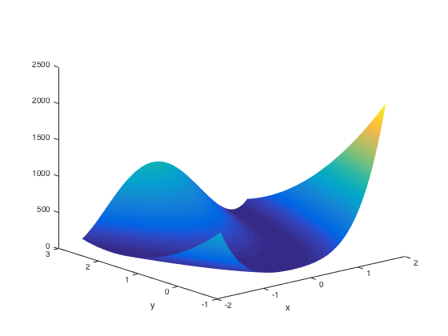
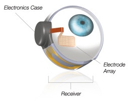
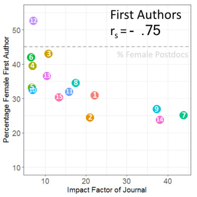

Open-source code is essential for reproducible science,
and we are committed to documenting and distributing all the software
that we develop for our research. \\
Each of the projects below represents the ideas and code of many collaborators.

# UW Toolbox

### A Matlab toolbox for vision research

The UW toolbox is a suite of Matlab functions used in vision research. \\
<a href="https://github.com/VisCog/UWToolbox" class="button">
  GitHub repo
</a>

 

# pulse2percept

### A Python-based simulation framework for bionic vision

Retinal dystrophies such as retinitis pigmentosa and macular degeneration
result in profound visual impairment in more than 10 million people worldwide.
One treatment approach, visual neuroprostheses, aims to restore vision
by electrically stimulating surviving cells in the retina,
analogous to cochlear implants. \\
To better understand the outcomes of this technology, we developed pulse2percept,
an open-source Python implementation of a computational model
that predicts the perceptual experience of retinal prosthesis patients
across a wide range of implant configurations.\\
<a href="https://github.com/uwescience/pulse2percept" class="button">
  GitHub repo
</a>
<a href="http://uwescience.github.io/pulse2percept/" class="button">
  Documentation
</a>
<a href="https://doi.org/10.25080/shinma-7f4c6e7-00c" class="button">
  Beyeler et al. (2017)
</a>

 

# Publications

### Shen et al. (2018): Women in High-Profile Journals

Our analysis of primary research papers in
15 prestigious multidisciplinary and neuroscience journals
in the MEDLINE database
indicates that the proportion of female authors in these journals
has been consistently low over the past 13 years. \\
Publication in distinguished journals advances careers,
so this under-representation negatively affects the careers
of thousands of female scientists. \\
<a href="https://www.nature.com/articles/d41586-018-02833-1" class="button">
  Shen et al. (2018)
</a>
<a href="https://www.biorxiv.org/content/early/2018/03/08/275362" class="button">
  Preprint
</a>
<a href="https://github.com/VisCog/Women_in_high_profile_journals" class="button">
  Code
</a>

 

